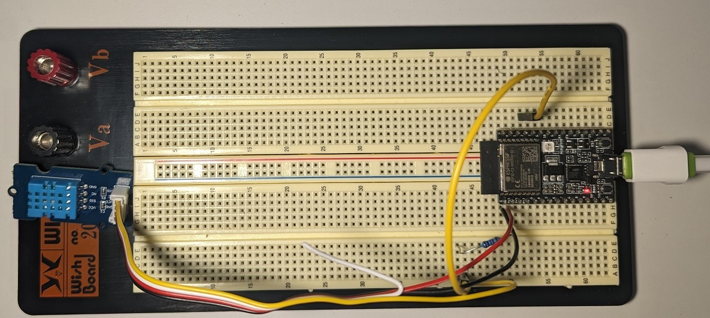

## DHT11 sensor

The aim of this project is to utilize the DHT11 temperature and humidity sensor, along with the ESP32-C3 (RISC-V) board, to collect and print data. The sensor's datasheet can be accessed at https://www.mouser.com/datasheet/2/758/DHT11-Technical-Data-Sheet-Translated-Version-1143054.pdf.


To initiate communication with the sensor, the data pin is first pulled low for 18us, and then pulled high. In response, the sensor pulls the data pin low for 80us, and then to high for 80us, indicating that it is ready to transmit data.


The sensor sends data in the form of 5 bytes (8-bit Integral RH, 8-bit decimal RH, 8-bit Integral temperature, 8-bit decimal temperature, 8-bit checksum). A '0' is represented by pulling the data pin high for 26 to 28 microseconds, while a '1' is represented by pulling it high for 70us. The fifth and final 8 bits can be used as a checksum by performing a bitwise-AND to verify the sent data.





The DHT11 Data wire is connected to ESP32 PIN 2 (see the ESP32 pin outs)


To compile and flash the ESP32-C3 board, follow these steps:
1. Enter "idf.py set-target esp32c3" in the command prompt.
2. Enter "idf.py build".
3. Replace "COM4" with the appropriate port for your board and enter "idf.py -p COM4 flash".
4. Finally, enter "idf.py -p COM4 monitor" to begin monitoring.

```
idf.py set-target esp32c3
idf.py build
idf.py -p COM4 flash
idf.py -p COM4 monitor
```

Please note that "esp32c3" and "COM4" must be replaced with the appropriate values should you have a different version of the board or if it is connected to a different COM port.


# Demo


https://github.com/0xAbby/dht11_sensor/assets/147592615/a99ae62b-f844-4b22-beb9-52cbeba2c5a7


